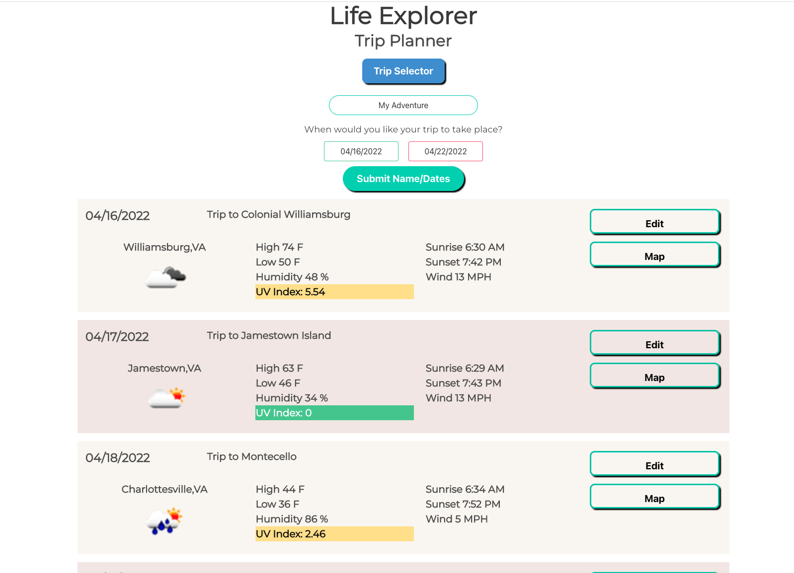
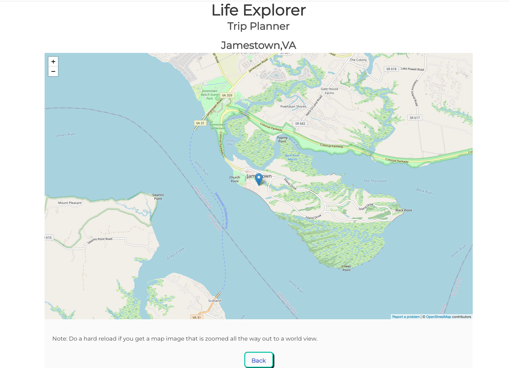

# Life Explorer - Trip Planner

## Description

This application is to assist in the planning of a successful adventure by providing an itinerary, weather and a map for each location for each day:

- The motivation for this application is to help plan a successful trip by providing critical weather and navigation information including:
    - a local map
    - an icon showing the forecasted weather - sunny, cloudy, raining ....
    - forecasted high and low temperature
    - forecasted humidity
    - forecasted UVI
    - forecasted sunrise and sunset times

- We are building this application to provide the type of information for a trip that we would like to know in one place.  
- There is also the added benefit of enhancing out frontend development skills as well as our project planning and collaboration skills.  

## Installation

Applciaton may be run from here: https://melliott7264.github.io/vacation-planner/

As a web app, there is nothing that needs to be installed per se.  There is some configuration which will be covered in the instructions.   All trip data is saved in local storage and be deleted, if desired, through Developer Tools.   Open up Developer Tools (Option - Command - i on a Mac ) and select Applicaton from the top level menu.  Under Local Storage and the URL for the applicaton you can delete the "vacation" file if you choose to delete your trip information.

## Usage

Application may be run from here: https://melliott7264.github.io/vacation-planner/

When you first load the applicaton, you will see the following Startup/Welcome screen.  Click on the Start button to get started setting up your adventure.

  

On this screen,  you will type in a name for your adventure as well as a start date and an end date.   Clicking on the date field will result in a pop-up calendar to assist you in picking your dates.   As our weather forcast data is limited to a week out, you can't pick an ending date more than 7 days out from the current date.   When you have typed in a name and selected and start and end date, click on the Submit Name/Dates button.

  
 
  

Next,  you will be presented with a screen of blank dates for your upcoming adventure.  You must enter an activity and a location for each date.   Do this by clicking on the Edit button.

Clicking on the Edit button will pop-up the following entry/edit screen allowing you to enter a detailed description of your activity for the day as well as a location.   You can type in any reasonable location.   We suggest a City and State in the format you normally enter it for an address.  You can also enter a full address.   Click on the Save button when you are done.

This will then dislay the date block with the new activity, the new location, and weather data for that location on that day.   You can also now click on the Map button to get a map of the location.

Once you are on the Map screen, you can zoom in and zoom out on the map and drag it around.  With a track pad, you pinch to zoom out and spread your fingers to zoom in.  You click and drag to move the map around.  Click on the back button to go back to the screen with all the day display blocks.  If  you get a map page that is zoomed all the way out to a world view, do a hard reload (Shift and click on reload button in Chrome).

If you would like to create a second or third trip plan or more, you can do that.  Just type the new trip name into the name field, select new dates (if you desire) and click on the Submit Names/Dates button again.  This will add the new trip.   To select and view  your trip, click on the Trip Selector button.  That will present you with the screen shown below.

On the screen above, click on the drop down menu and select the trip you wish to view.  Then just click on the Select button.   If you want to delete the selected trip, click on the Remove button.  

## Credits

Repository for application code: https://github.com/melliott7264/vacation-planner

Developers:   

Thomas Ciszek  https://github.com/ThomasCsk

Mark Elliott  https://github.com/melliott7264

Megan Middleton  https://github.com/youngff43

APIs, frameworks, and resources:

Used Positionstack (https://positionstack.com/) and Open Weather (https://openweathermap.org/) APIs.

Used Bulma CSS Framework (https://bulma.io/).

Used Google fonts https://fonts.google.com/

Used iconic https://useiconic.com/open

Used Jquery and Jquery UI.

## License

Copyright (c) 2022 Thomas Ciszek, Mark Elliott, and Megan Middleton

Permission is hereby granted, free of charge, to any person obtaining a copy
of this software and associated documentation files (the "Software"), to deal
in the Software without restriction, including without limitation the rights
to use, copy, modify, merge, publish, distribute, sublicense, and/or sell
copies of the Software, and to permit persons to whom the Software is
furnished to do so, subject to the following conditions:

The above copyright notice and this permission notice shall be included in all
copies or substantial portions of the Software.

THE SOFTWARE IS PROVIDED "AS IS", WITHOUT WARRANTY OF ANY KIND, EXPRESS OR
IMPLIED, INCLUDING BUT NOT LIMITED TO THE WARRANTIES OF MERCHANTABILITY,
FITNESS FOR A PARTICULAR PURPOSE AND NONINFRINGEMENT. IN NO EVENT SHALL THE
AUTHORS OR COPYRIGHT HOLDERS BE LIABLE FOR ANY CLAIM, DAMAGES OR OTHER
LIABILITY, WHETHER IN AN ACTION OF CONTRACT, TORT OR OTHERWISE, ARISING FROM,
OUT OF OR IN CONNECTION WITH THE SOFTWARE OR THE USE OR OTHER DEALINGS IN THE
SOFTWARE.

---

